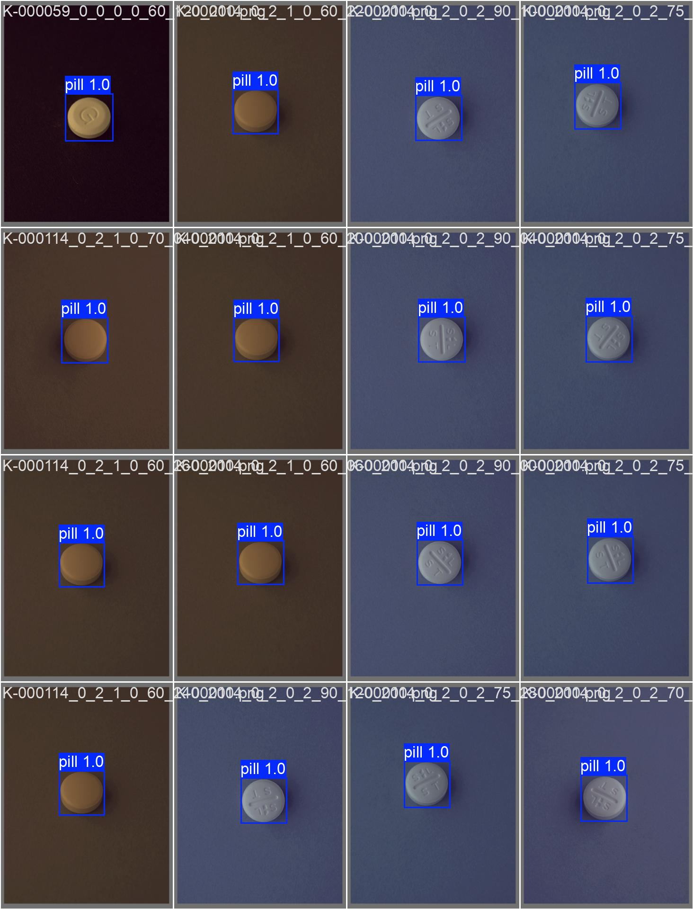

## Pill Detection with YOLOv8

본 프로젝트는 약 이미지에서 알약(pill)을 탐지하기 위한 YOLOv8 기반 객체 탐지 모델을 구축하고,  
탐지된 알약을 crop하여 분류(classification) 모델 학습을 위한 데이터셋을 생성하는 것을 목표로 합니다.

## YOLOv8 모델 훈련 정보

- 모델: `yolov8n.pt` (Ultralytics Pretrained)
- 학습 epochs: 5
- 이미지 크기: 640x640
- 디바이스: NVIDIA RTX A6000 (GPU)
- 프레임워크: PyTorch + Ultralytics

### 성능 (Validation 결과)
- mAP@0.5: 0.995
- mAP@0.5:0.95: 0.987

## 사용한 데이터셋

- 출처: AIHub 약 이미지 데이터셋
- 클래스: 단일 클래스 (`pill`)
- 총 사용 이미지 수: 약 10,000장 (train:val = 8:2)
- 선택 기준: 데이터셋 1번 폴더 내 약 이미지 중 임의로 샘플링
- 라벨 형식: COCO → YOLO 포맷 변환

## YOLOv8 추론 + 크롭 스크립트 (하위 폴더 포함)
```
bash scripts/run_inference.sh
```

## YOLOv8 학습 결과 시각화



## YOLOv8 추론 + 크롭 결과 시각화
